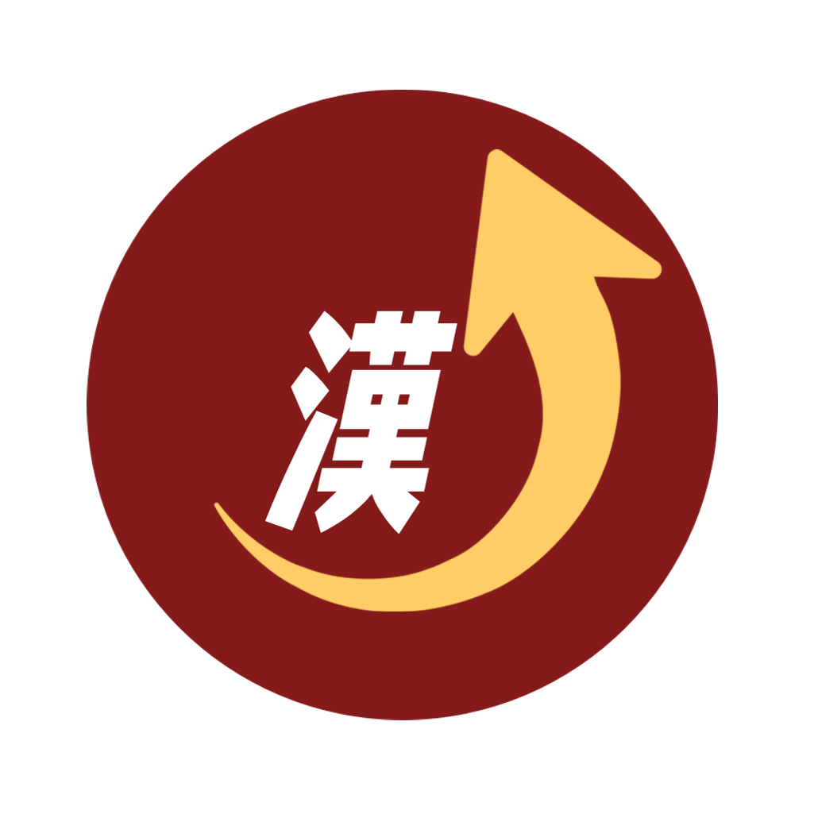
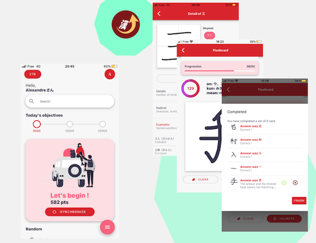
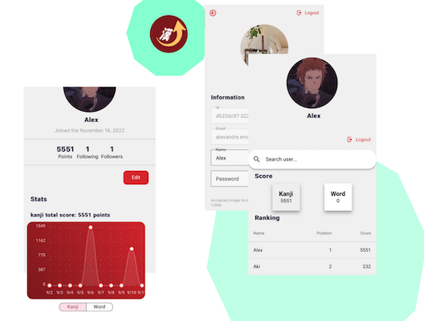

  

<h1 align="center">KanjiUp</h1>

# KanjiApp

## Front-end applications

### KanjiUp

KanjiUp is an application that will help the user to learn and memorize Japanese kanji with Flashcard and drawing recognition (~2600 kanji can be recognized).

Web application:

Android application (APK): _Last update : 9/21/2023_

### KanjiUp User

Manage User's information, friends and visualize scores, progressions

Web application:

### KanjiUp Word (TODO)

A Japanese-english dictionnary application.
Users can add the words they want to learn and then test their uses with some quizz

### KanjiUp BackOffice (TODO)

BackOffice allowing users with the right permissions to manage (add, update or delete) kanji's information.

## Back-end services

### Auth

Manage permissions based authentication to KanjiUp apps and all data related to the user's (auth side)

### KanjiUp

Manage all data related to the kanji's characters

### Recognition (WIP)

Allows to recognize a handwritted kanji, upload new data (handwritted kanji) in order to improve the recognition model

### User (TODO?)

Manage user's data like statistics (application side)

### Word or Dict (TODO)

Manage all data related to japanese's words
